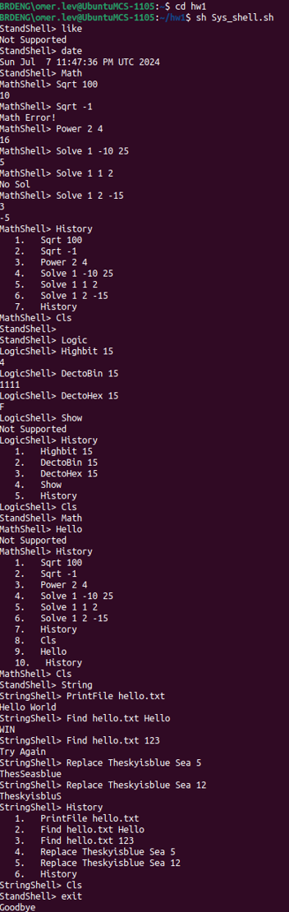

# 🐚 CustomLinuxShell

A custom-built Linux shell implemented in C, using **low-level system calls only** (`open`, `read`, `write`).  
This educational shell mimics core UNIX behavior and introduces **three specialized sub-shells**:

- `MathShell` ➗  
- `LogicShell` 🔢  
- `StringShell` 🔤  

🔧 Built for UNIX systems using `fork()` and `exec()` for process creation, and direct system calls like `open`, `read`, and `write`. No use of `system()`.

## ✨ Features

- ✅ Supports standard Linux commands (up to 3 arguments)  
- 🧮 Math operations (sqrt, power, solve quadratic)  
- 🧠 Bitwise & number logic (binary/hex conversions, bit counting)  
- 📝 String file operations (find, replace, print file)  
- 🧠 Command history per shell  
- 📂 Organized file structure under `/Commands`  
- 🚫 Graceful handling of unsupported commands or file errors  

## 🧪 Sample Execution



## 🚀 How to Run the Project

You can run this project either on **GitHub Codespaces** or on any **local Linux machine**.

### 🖥️ Option 1: Run in GitHub Codespaces

#### ✅ Steps:

1. **Open the project in Codespaces**  
   Click the green **"Code"** button → **"Open with Codespaces"** → New codespace

2. **In the Codespaces terminal:**

```bash
chmod +x Sys_shell.sh
./Sys_shell.sh
```

---

### 🐧 Option 2: Run on Local Linux Machine

#### 🧱 Requirements:

Make sure you have **GCC** installed:

```bash
sudo apt update
sudo apt install build-essential
```

#### ✅ Steps:

1. **Clone the repository:**

```bash
git clone https://github.com/your-username/CustomLinuxShell.git
cd CustomLinuxShell
```

2. **Make the script executable:**

```bash
chmod +x Sys_shell.sh
```

3. **Compile and run the shell:**

```bash
./Sys_shell.sh
```

## 🧑‍💻 How to Use

After running the shell, you will be presented with a custom prompt:

```
StandShell>
```

From here, you can:

- Run any standard Linux command (with up to 3 arguments)
- Type `Math`, `Logic`, or `String` to enter one of the custom sub-shells:
  - `MathShell>` for math operations
  - `LogicShell>` for logic/bitwise operations
  - `StringShell>` for file and string operations
- Use the `exit` command from `StandShell>` to quit the program

Each sub-shell supports its own unique set of commands, as listed below.

---

### 📁 Using `StringShell`

To use commands like `PrintFile`, `Find`, or `Replace`, you must ensure the file you're working with **already exists** in the project directory.

#### ✅ You have two options:

1. **Use the provided example file**:  
   A sample file named `hello.txt` is already included in the project.

2. **Create your own `.txt` file** before launching the shell:  
   You can do this via terminal:

   ```bash
   echo "Hello from CustomLinuxShell" > myfile.txt
   ```

> 💡 Tip: You don’t have to create a new file from scratch - you can also copy and paste any existing `.txt` file into the project folder (in Codespaces or locally).

## 📖 Supported Commands

### 🧭 `StandShell` (Main Shell)

| Command        | Description |
|----------------|-------------|
| `exit`         | Exits the shell, deletes `Commands`, prints "Goodbye..." |
| `Math`         | Enters MathShell |
| `Logic`        | Enters LogicShell |
| `String`       | Enters StringShell |
| Linux commands | e.g. `ls -l`, `mkdir`, `grep`, up to 3 args |

---

### ➗ `MathShell`

| Command              | Parameters | Description |
|----------------------|------------|-------------|
| `Sqrt <num>`         | 1          | Square root of the number |
| `Power <base> <exp>` | 2          | Raises base to exponent |
| `Solve <a> <b> <c>`  | 3          | Solves quadratic equation |
| `History`            | —          | Shows command history |
| `Cls`                | —          | Returns to StandShell |

---

### 🔢 `LogicShell`

| Command            | Parameters | Description |
|--------------------|------------|-------------|
| `Highbit <num>`    | 1          | Counts the number of 1s in binary form |
| `DectoBin <num>`   | 1          | Converts decimal to binary |
| `DectoHex <num>`   | 1          | Converts decimal to hex |
| `History`          | —          | Shows command history |
| `Cls`              | —          | Returns to StandShell |

---

### 🔤 `StringShell`

| Command                                | Parameters                    | Description |
|----------------------------------------|--------------------------------|-------------|
| `PrintFile <filename>`                 | 1                              | Prints file content |
| `Find <filename> <string>`            | 2                              | Searches string in file |
| `Replace "<str>" <word> <index>`      | 3 (quoted str, word, index)    | Replaces word in string at index |
| `History`                              | —                              | Shows command history |
| `Cls`                                  | —                              | Returns to StandShell |

---

### ❗ Error Handling

- Unknown commands:
  ```
  Not Supported
  ```

- File open failure:
  ```
  Error! File Not Found
  ```

## 📎 The Assignment

This project was developed as part of the **Operating Systems** course in the Software Engineering program.

The original assignment specification (in Hebrew) is included here:  
[📄 Assignment.pdf](./Assignment.pdf)